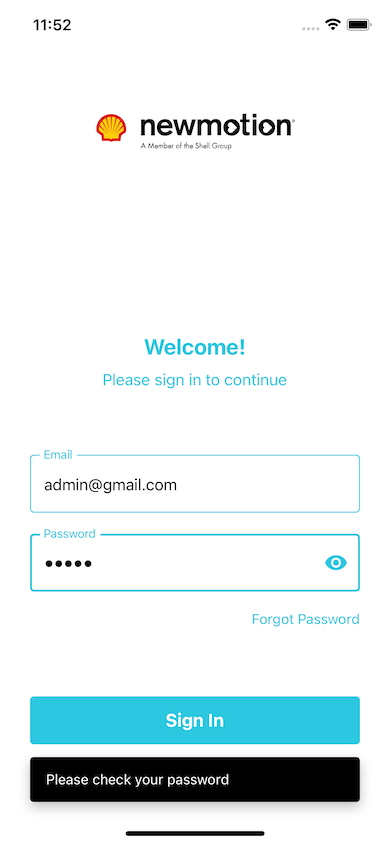
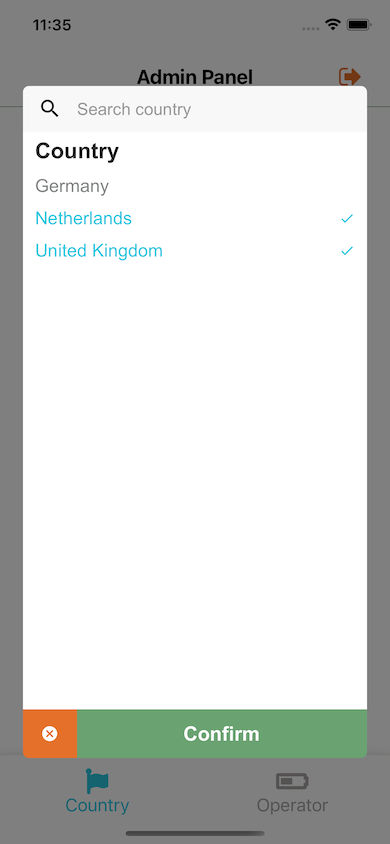

## Get Started

### 1. System Requirements

- Globally installed [node](https://nodejs.org/en/)

- Globally installed [react-native CLI](https://facebook.github.io/react-native/docs/getting-started.html)

- You will need Watchman, Xcode and CocoaPods as described in [Official React Native documentation](https://reactnative.dev/docs/environment-setup#installing-dependencies)

### 2. Installation

On the command prompt run the following commands

```sh
$ git clone https://github.com/ahmetgsu/ev-assignment.git

$ cd ev-assignment/

$ yarn
  or
  npm install

  (I suggest using yarn instead of npm)

$ cd ios && pod install
```

### Run on iOS 📱

- Run `npx react-native run-ios` in your terminal, on the root folder of the project

### Signin to app

I have created 2 separate users: admin and user

```sh
Admin Account: email: admin@gmail.com - password: secret
User  Account: email: customer@gmail.com - password: 123
```

Since it is just a front-end task, I checked email and password control on front-end. I handled wrong email and password combinations.
When user successfully signed-in, according to the user role, which is determined by isAdmin prop in `mocks/users.js file`, a related user interface is shown.

I have created a dummy chargepoints data in `mocks/chargepoints.js`. When application is loaded for the first time, this data is written to AsyncStorage. Then, users can make CRUD operations.
I have choosen 3 countries (Netherlands - Germany - UK), and created 3 operators in each countries.

### Aim of the project 🎯

- To create a react native application that has 2 seperate user interfaces.
  One for admin user in which admin can create a promotion for Country and/or Operator.
  Other is for standart user interface in which user may create a charging session and may see all his/her past charging sessions.

- My main focus is to create a well working react native application on IOS to keep it simple. Android settings are ignored.

* Users are able to see past charging details after tapping related card (includes map integration).

### Personal Choices

#### Roles

- In order to keep the app flow simple in lack of project back-end, I decided to give a boolean `isAdmin` value to user object to differenciate roles.
  Acccording to this isAdmin value different user interfaces are shown.


This can be acceptable in a simple app but in a real life application user roles should be determined in a precise way. We may think of describing roles as follows:


In my simple application, I prefer to have a single signin screen and redirect users to the related screen according to their boolean role. However, in a real-life app, roles may be more complex (e.g. an admin user may also be a customer). It would be better to handle user role as an array of objects. On the other hand, it would be better to have different sign-in screens (for admin and for customers) in order to prevent complications during the signin process.

#### Technical

- I prefer to use custom `Block` and `Text` components instead of native `View`, `Text` components. Creating a custom component lets me prevent using inline styling and I think it is more readable.
- I have choosen `FlatList` instead of simple `ScrollView` component taking into account performance issues. FlatList is more permformant when we have unlimited number of items to display on the screen and it provides us scroll-to-fetch feature.

### Demo


### ScreenShots

 

 

 

 

 

 

 

 

 
